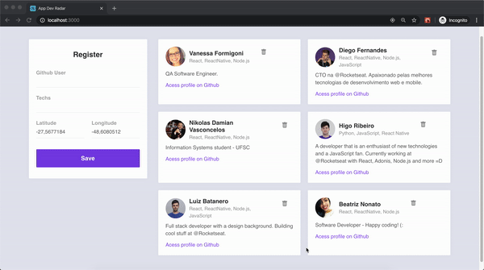
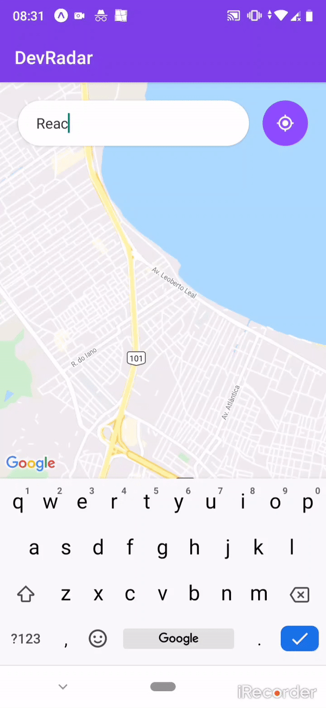
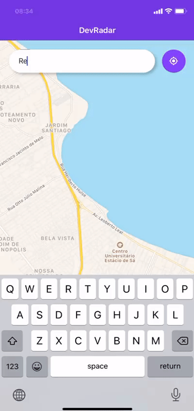

## App Dev Radar

_This app was created on the Omnistack week taught by Rocketseat._

It was used ReactJs, Node.js and React Native to build a web and mobile version. The objective is to add Devs and localize the Devs by the Technology needed for the job, filtering by a 20km radius.

 ### :rocket: Technologies:

#### :woman_technologist: Backend

-   [Node.js](https://nodejs.org/en/docs/)
-  [CORS](https://github.com/expressjs/cors)
-   [Axios](https://github.com/axios/axios)
-   [Express](https://expressjs.com/)
-   [Mongoose](https://mongoosejs.com/)
-   [Socket.io](https://socket.io/)

#### :computer: Web

-   [React JS](https://reactjs.org/)
-   [Axios](https://github.com/axios/axios)

#### 📱Mobile

-   [Expo](https://expo.io/)
-   [Axios](https://github.com/axios/axios)
-   [ReactJS](https://facebook.github.io/react-native/)
-   [Socket.io](https://socket.io/)
-   [React Native](https://facebook.github.io/react-native/)
-   [Expo Location](https://docs.expo.io/versions/latest/sdk/location/)
-   [React Navigation](https://reactnavigation.org/)
-   [React Native Maps](https://github.com/react-native-community/react-native-maps)
-   [Expo Vector Icons](https://docs.expo.io/versions/latest/guides/icons)
-   [React Native WebView](https://github.com/react-native-community/react-native-webview)

### How to access:

 **Clone this repository**
`https://github.com/vanessamcf/App-Dev-Radar.git`

**Go into the repository**
`cd Dev_radar`
 
 **Install dependencies**
`yarn install`

**Run the application**
**Web**: `backend` + `web`  and for **Mobile**: `backend` + `mobile`

**Web Version** : It is possible add Devs with the technologies and localization and remove them.

**Go into the repository**: `cd backend`

`yarn dev`

**Go into the repository** : `cd web`

`yarn start`

**Mobile Version** : It is possible to Seach Devs for they techs abilities in a 20km radius.

**Go into the repository** : `cd mobile`

`yarn start`

**Android**

**IOS**

##  :page_facing_up: License

This project is under the MIT license. See the  [LICENSE](https://github.com/mlg404/omnistack10-mobile/blob/master/LICENSE)  for more information.
